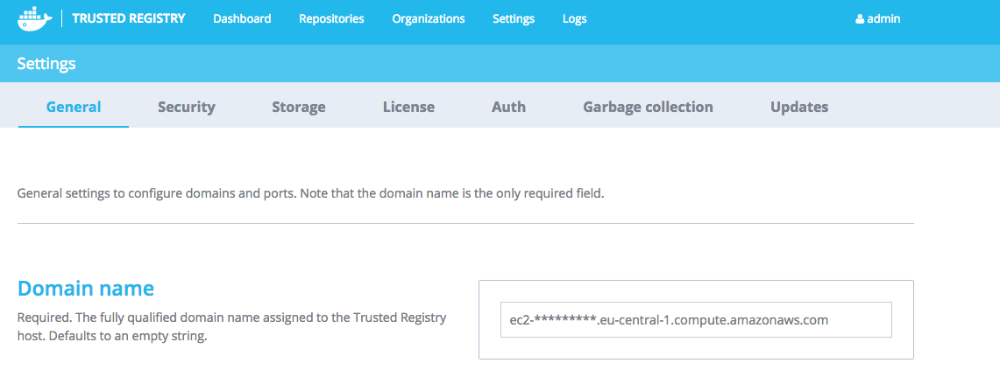
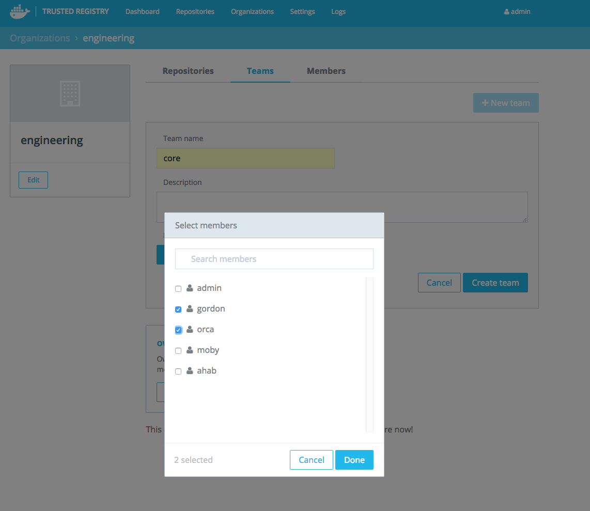
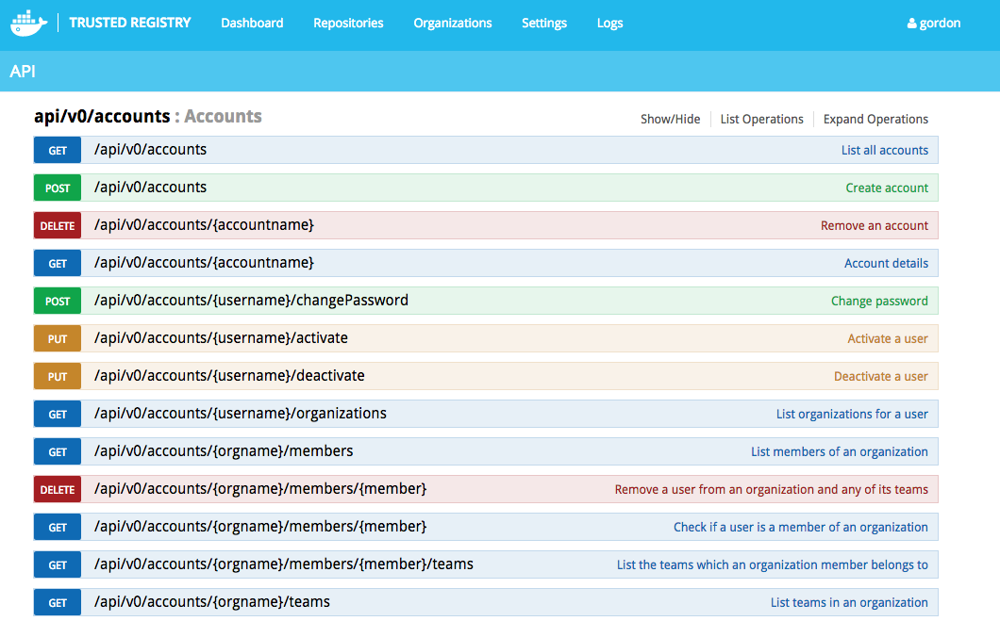

# Lab 3 : Docker Trusted Registry

> **Difficulty**: Intermediate

> **Time**: 30 minutes

> **Tasks**:
> 
- [Prerequisites](#prerequisites)
- [Task 1: Install DTR](#task-1-install-dtr)
- [Task 2: Setting up DTR](#task-2-setting-up-dtr)
- [Task 3: Creating Organizations, Teams, Members,and Repositories](#task-3-creating-organizations-teams-membersand-repositories)
- [Task 4: Pushing and Pulling DTR Images](#task-4-pushing-and-pulling-dtr-images)
- [Task 5: Storage and Logs](#task-5-storage-and-logs)
- [Task 6: DTR API Console](#task-6-dtr-api-console)
- [Task 7: Deleting Images](#task-7-deleting-images)

# Getting Started with Docker Trusted Registry (DTR)

Docker Trusted Registry is a secure, on-premise, commercially supported,and enterprise-class image registry. Docker Trusted Registry features an easy-to-use web admin portal,  Active Directory / LDAP integration, cloud storage backends, image provenance, and highly secure authentication and authorization.

Docker released DTR 1.4 on November 12th, 2015. With 1.4 you have new awesome features like:

* Repository Search
* Image Provenance (Integration with Docker Content Trust)
* Organization, Teams, and Members
* Image Garbage Collection ( Hard Image Deletes )
* Image Deletion from Index ( Soft Image Deletes )
* API Console + Documentations
* New Storage Drivers Support (Openstack Swift)

## Prerequisites

* You will use two nodes: **node-0** and **node-1**
* Ensure that no containers are running on these containers.
* Ensure that Docker engine uses default daemon options( `DOCKER_OPTS` should be commented out in `/etc/default/docker` file)
* Ensure that DOCKER_HOST is unset ( `$unset DOCKER_HOST` )
* Certain TCP ports are only allowed on the private AWS network. Therefore, you would need to use the private network (10.X.X.X) when you substitute the IP of the instance in certain commands/configuration files throughout this lab.

## Task 1: Install DTR

Installing DTR is fairly simple. You can install DTR on **node-0** by:

```
node-0$ sudo bash -c "$(sudo docker run docker/trusted-registry install)"
```

This step will automatically download and run the required containers that comprise the Docker Trusted Registry service. It might take a couple of minutes to complete. Once complete, check if all DTR containers are up using `$ docker ps`.

## Task 2: Setting up DTR

Now that DTR is up and running, you may start configuring it. We will follow three steps to get DTR set-up:


**Step 1:** **Authentication Settings**:

In this step you will configure DTR authentication. DTR supports the following authentication options: "None", "Managed" and "LDAP". "None" disables authentication. "Managed" will use a local user database (via the `postgres` container). "LDAP" allows you to integrate your own LDAP service with DTR. We will use the "Managed" authentication option in this tutorial.

* Using your favorite web browser, go to your **Node 0** domain name using HTTPS. e.g `https://ec2-xxxxxxxx.<region>.compute.amazonaws.com`
* Proceed insecurely.
* On DTR landing page, go to **Settings** >> **Auth**, and ensure you enable **Managed Authentication**.
* Create a new user by clicking on the **Add user** button. Then fill in a username and password with **admin** rights(by selecting the ‘admin’ option on the right) and click **Save**
* The page will be reloaded and you will be prompted to login. Use the username/password that you just created.


**Step 2:** **Upload License**

If you already have a DTR license you can use here. If not, please go [here](https://hub.docker.com/enterprise/trial/) to get a **Free 30-day Trial DTR** license.

* Go to [Docker Hub](https://hub.docker.com/account/settings/) and sign in.
* Go to **your-username >> Settings >> Licenses** and click the download button shown below


* Go back to your DTR site, and upload the downloaded license in **Settings** >> **Licenses**.
* Click **Save and restart**.

**Step 3:** **Configure Domain Name**

Navigate to the '**General**' tab and provide the **node-0**'s public DNS name as "**Domain name**". Then click **"Save and Restart"**.



**Note:** When the DTR server restarts you will get another authentication warning. This is because the DTR servers certificate has been updated with a new hostname.

## Task 3: Creating Organizations, Teams, Members,and Repositories

One of the newly added features of Docker Trusted Registry is the ability to create Organizations,Teams, and Members for easier management, increased security, and enhanced auditing. You have the ability now to group multiple members with different privileges into a team and associate that team to an organization. Let's use the following scenario throughout this task:

**Scenario :** Let's assume your engineering organization is working on a new project based on two repositories `barca` and `madrid`. The project involves two teams: **Core** and **Frontend**. The Core team includes the users **gordon** and **orca**. The Frontend team includes the users **gordon, moby, and ahab**. You'd like to ensure that both teams can collaborate on this project with one restriction: **ahab** can only access the `madrid` repo.  


**Members and Roles**

Let's start by creating four users: **gordon, orca, moby and ahab**. Three members have global roles that would provide read (**moby**), read-write (**orca**), or admin(**gordon**) access to **ALL** repos in DTR regardless of which team or organizations they belong to. The fourth member **ahab** does not have a global role. Non-global users do **NOT** have access to all the repositories in DTR. Instead, they can only access their personal repositories or repositories that belong to teams they are part of.

**Step 1:** Navigate to **Settings** >> **Auth** and add the users as follows:


**Step 2:** Click **Save**

**Organizations and Teams**

Go to **Organizations** tab and click **New Organization**. Name the organization '**engineering**', and click **Save**.


**Step 3:** Click on the newly created '**engineering**' organization, and click on the **Teams** tab and click **New Team**. Name the team '**core**' and click **Add Members**. You will see a list of all the DTR users. Select **gordon** and **orca** to be part of the **core** team. Then click **Create Team**.



**Step 4:** Similarly, create another team called **frontend** and add **gordon, moby and ahab**. Then click **Create Team**.


**Creating Repositories**


Repositories can belong to an organization e.g **{DTR Hostname}/{Organization Name}/{Repo Name}:{Tag}** or to a user **{DTR Hostname}/{User Name}/{Repo Name}:{Tag}**. Any user can create a personal repository by going to **Repositories**>>**New Repository**. But only members of an organization owners team can create an organization repository. You can create a new organization repository by going to **Organizations >> {Organization Name}** or by going to **Repositories**>>**New Repository** and selecting the desired organization namespace from the dropdown menu.

Global members have access to all repos ( even repos that belong to organizations they do not belong to). The value of assigning repos to teams comes when you need certain non-global users to have access to team-level repos ONLY. In our case, this helps us achieve restricting **ahab** to the Frontend's **madrid** repo.

**Step 5:** Go back to **Organizations**, click on **Teams**, click on **core** team, and click **Add Repository**. 

**Step 6:** Go through creating the repo and call it **barca**. Make sure it's listed as **Private**. 


**Step 7:** Select '**Read-Only**', this way all members that do not have global roles but are part of the '**core**' team only can pull this repo. Click **Done** to create the repo.

Note: All members of an organization can access the **Private** repos of that organization. **Public** repos are exactly what they sound like; they can be pulled by **anyone** without any authentication (similar to Docker Hub public repos). The drop-down permission options indicate what non-global users are authorized to do with this repo. 

**Step 8:** Next, create another private repo called **madrid** for the **frontend** team. Select '**Read-Write**' permission option. This way **ahab** is able to both push and pull this repo only. Once you are done you should see the following:


## Task 4: Pushing and Pulling DTR Images

In this task, we will pull a sample image from Docker Hub and test pushing it to and pulling it from DTR.

Creating the repository from the UI is required before being able to push to that repo. Now that we created two repositories (**madrid and barca**), we can use **node-1**'s Docker engine to login into DTR and push sample images.

**Step 1:** Log into **node-1** and trust DTR using the following steps. The first step is to trust the SSL cert of DTR followed by user login. Since you need a minimum of read-write permissions to be able to push to a repo, please log in as **orca**. If any of the following commands fail, please use `sudo -e` before the command.

```
### Make sure to substitute DTR_DOMAIN_NAME with the domain name of your DTR.

node-1$ export DTR={DTR_DOMAIN_NAME}

node-1$ openssl s_client -connect $DTR:443 -showcerts </dev/null 2> /dev/null | openssl x509 -outform PEM | sudo tee /usr/local/share/ca-certificates/$DTR.crt

node-1$ sudo update-ca-certificates

node-1$ sudo service docker restart

node-1$ docker login https://$DTR

Username : orca
Password:
Email:
WARNING: login credentials saved in /root/.docker/config.json
Login Succeeded
```

**Step 2:** Pull the latest **busybox** image
 ```
node-1:~$ docker pull busybox
Using default tag: latest
latest: Pulling from library/busybox
Digest: sha256:87fcdf79b696560b61905297f3be7759e01130a4befdfe2cc9ece9234bbbab6f
Status: Image is up to date for busybox:latest
 ```

**Step 3:** In order to push an image to DTR, we need to name and tag it appropriately following this format : **{DTR Hostname}/{Organization Name}/{Repo Name}:{Tag}**

 `node-1:~$ docker tag busybox:latest $DTR/engineering/barca:lona`

**Step 4:** Now, we can push to DTR:

```
node-1:~$ docker push $DTR/engineering/barca:lona
The push refers to a repository [***************************] (len: 1)
c51f86c28340: Pushed
039b63dd2cba: Pushed
lona: digest: sha256:5f2a5500a6d91e02d1cb72a04446db2790bfe932d12d77963a88ee964e17a0fb size: 3214
```


###w00t!


**Step 4:** Logout and login as **moby** who only has read-access.

```
node-1:~$ docker logout $DTR
Not logged in to *************compute.amazonaws.com
root@node-1:~# docker login $DTR
Username: moby
Password:
Email:
WARNING: login credentials saved in /root/.docker/config.json
Login Succeeded
```
**Step 5:** Try to pull the image that **orca** just pushed:

```
node-1:~# docker pull $DTR/engineering/barca:lona
lona: Pulling from engineering/barca
Digest: sha256:5f2a5500a6d91e02d1cb72a04446db2790bfe932d12d77963a88ee964e17a0fb
Status: Image is up to date for **************.compute.amazonaws.com/engineering/barca:lona
```

**Step 6:** You can see that since **moby** has read access, he can pull the **barca** image. Try to push to **barca** and observe what happens:

```
root@node-1:~# docker tag busybox:latest  $DTR/engineering/barca:latest
root@node-1:~# docker push $DTR/engineering/barca:latest
The push refers to a repository [*********.amazonaws.com/engineering/barca] (len: 1)
c51f86c28340: Preparing
unauthorized: authentication required
```

Note: If you log in as **ahab** in the DTR web portal, you will notice that you don't see all of **ahab** organization's repos. Only repos that belong to the his team (**Frontend**) are visible to him. 

**Step 7:** Let's logout from DTR:

```
node-1:~$ docker logout $DTR
Not logged in to *************compute.amazonaws.com
```

**Step 8:** Log in as **ahab** to test pushing and pulling DTR repos.

```
node-1:~# docker login https://$DTR
Username: ahab
Password:
Email:
WARNING: login credentials saved in /root/.docker/config.json
Login Succeeded
```

**Step 9:** Tag and push to **madrid**:

```
node-1:~$ docker tag busybox $DTR/engineering/madrid:latest
node-1:~$ docker push $DTR/engineering/madrid:latest
The push refers to a repository [*******.eu-central-1.compute.amazonaws.com/engineering/madrid] (len: 1)
c51f86c28340: Pushed
039b63dd2cba: Pushed
latest: digest: sha256:0ec6285600961f4ded79bef0a3483f80b8e992df5922ae5bd4d78b1d13a10f6a size: 2746
```
This step succeeded because **ahab** is a member of the **Frontend** team. He has access to pull and push to **madrid** repo. 

**Step 10:** Try to push to **barca**:

```
node-1:~$ docker push $DTR/engineering/barca:lona
The push refers to a repository [*******.eu-central-1.compute.amazonaws.com/engineering/barca] (len: 1)
c51f86c28340: Image push failed
unauthorized: access to the requested resource is not authorized
```

Exactly as expected!!! This step failed because **ahab** is a not a member of the **Core** team. He therefore can not pull and push to **barca** repo. 


## Task 5: Storage and Logs

DTR supports multiple storage backends : Local Filesystem, S3, Azure, and Swift. To avoid data loss due to host failures, it's recommended to use a cloud based service like Azure, S3, or OpenStack Swift to store image layers. If you use a cloud service for storage, DTR or host failures will not result in losing any images. The default storage backend is local host filesystem. You can configure the storage backend by going to **Settings**>>**Storage** and providing required information there. There is no need to do anything in this tutorial.

DTR provides a streaming log for all containers that make up DTR ( auth , load-balancer, database, storage, registry, and index). If you navigate to the **Logs** tab you can select a DTR service and review its most recent logs.


## Task 6: DTR API Console

DTR is built on top of a powerful API that provides all of the functionality available in the UI, plus more. DTR's API uses standard HTTP verbs: GET/PUT/POST/DELETE with JSON-formatted results. To make it easy for developers to work with DTR, DTR 1.4 provides an API Console coupled with corresponding documentation. You can use the API console to post directly to the API and easily see the results.

**Step 1:** Hover over **admin** ( or whichever user you're login in with) on top right corner and click on the **API Docs** button. You can see full documentation and detailed API endpoint and action descriptions.

**Step 2**(Optional): Feel free to try making any call against the API and observe the result.




## Task 7 : Deleting Images

DTR supports two types of image deletion : soft and hard. Soft deletion is removing the image from the UI/Index. Hard deletion is deleting all image layers from disk and is accomplished via the newly added **Garbage Collection** feature.

**STEP 1:** Log in as **admin** from DTR web portal. 

**STEP 2:** click on **repositories** and select **engineering/barca**

**STEP 3:** You will notice all the available tags on the right. **lona** should be listed. Click on the small trash icon next to it to perform a soft delete of this specific tag of the image. 

**STEP 4:** After you click on the trash icon, you will notice that the **lona** tag is gone but the repo still exists.

Note: You can also soft delete the repo itself by clicking on **REPO NAME**>>**Settings**>>**Delete**. But you do not need to delete the repo.

Although we removed the image from the UI, on disk it still persists. To remove it from disk, we have to use the **Garbage Collection** feature. Garbage collection runs as a cron job that deletes deleted images unused/unreferenced layers from disk. 

**STEP 5:** Navigate to **Setting** tab and click on **Garbage Collection**.

**STEP 6:** Plug in `0 0 0 * * *` and click **Save**. Garbage collection now will run everyday at midnight.

Now that the garbage collection was set up, the next time it runs it will delete **barca:lona** image from disk.

## Conclusion

Congrats! You have completed the tutorial!

In this tutorial we went over the new Docker Trusted Registry features introduced in 1.4. We created a organizations with teams and members. We then created repos and assigned them to teams. We tested logging in and pulling/pushing to DTR.

### Share on Twitter!

<p>
<a href="http://ctt.ec/hXba1" target=“_blank”>

</p>


## Clean up

If you plan to do another lab, you need to cleanup your EC2 instances. Cleanup removes any environment variables, configuration changes, Docker images, and running containers. To do a clean up, log into each EC2 instance and run the following:

```bash
$ source /home/ubuntu/cleanup.sh
```

## Related Information

[Docker Trusted Registry](https://docs.docker.com/docker-trusted-registry/)
