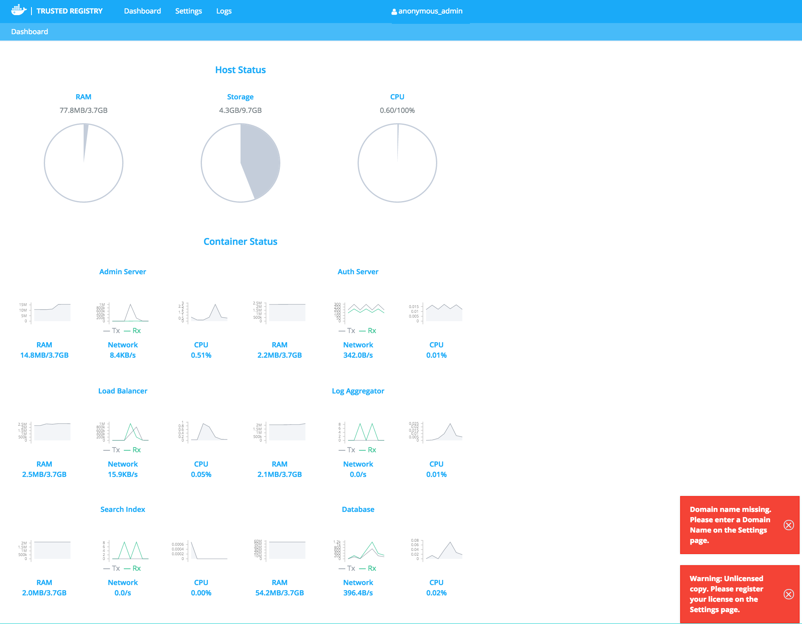
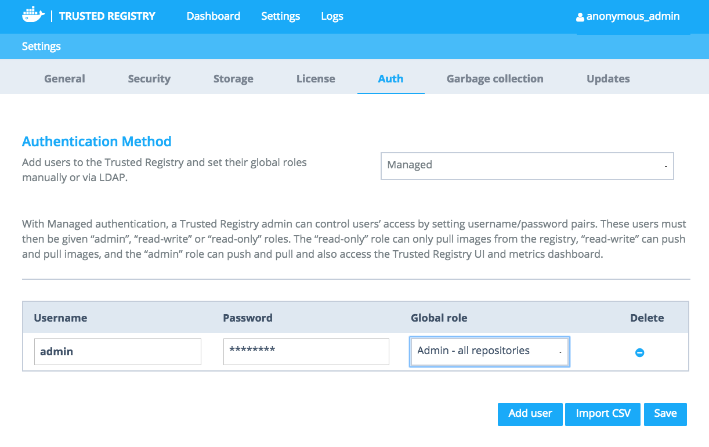
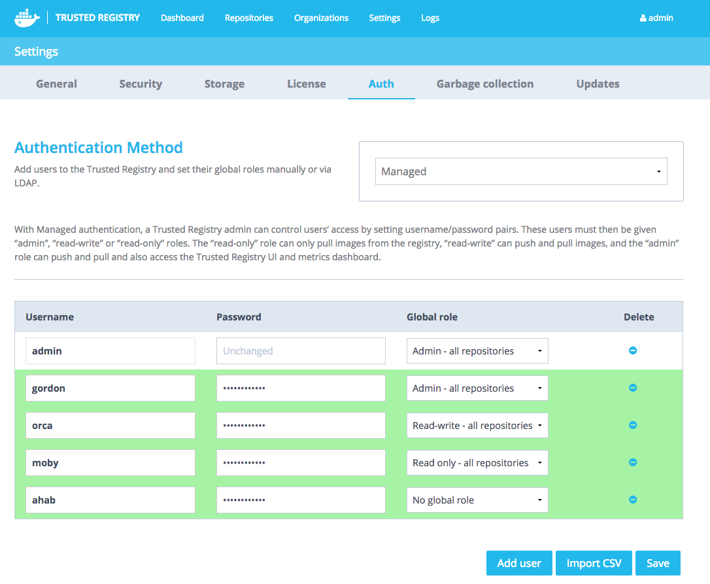
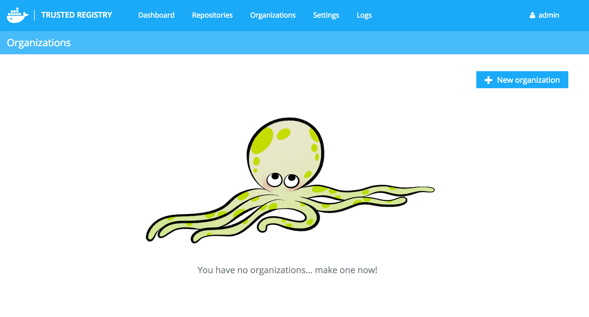
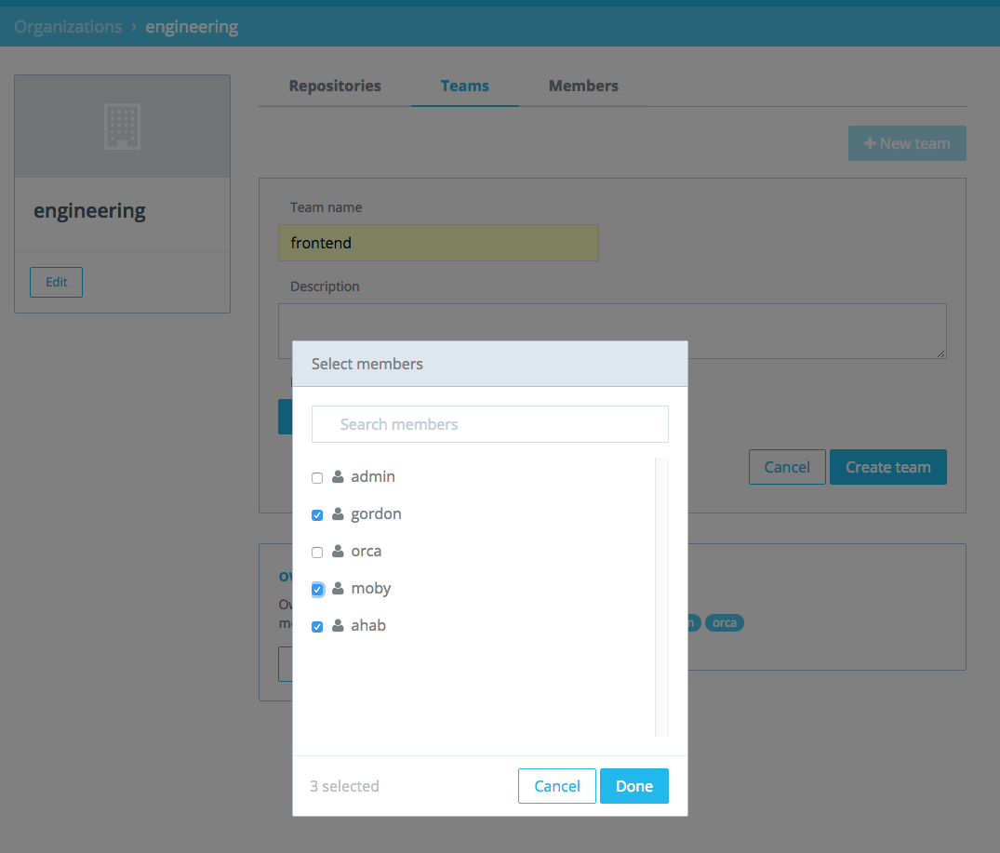
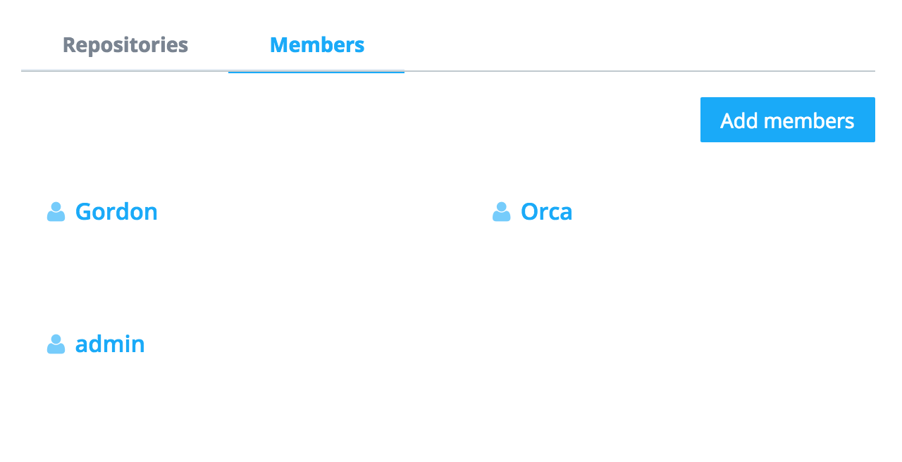
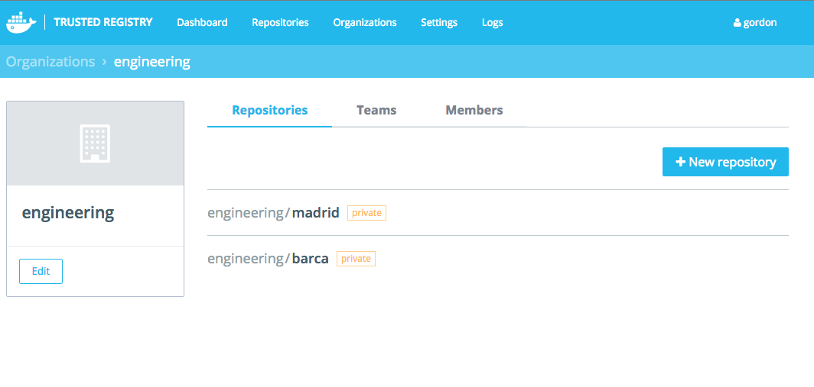
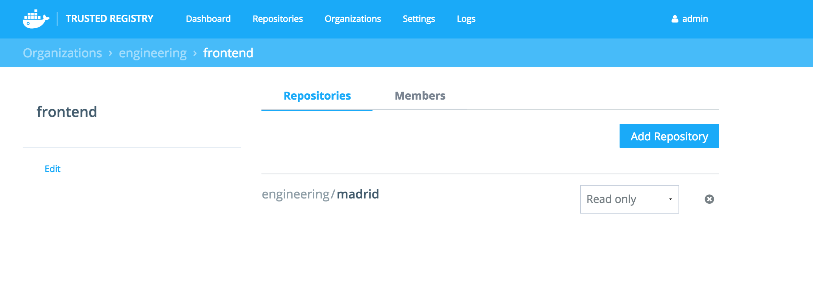
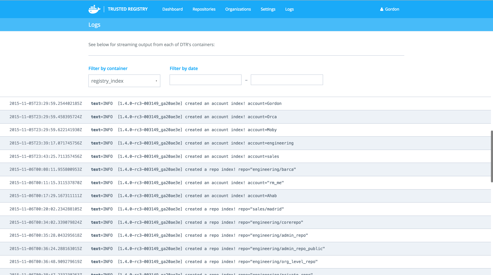

# Tutorial 3 : Docker Trusted Registry

> **Difficulty**: Intermediate

> **Time**: 20-30 mins

> **Prequisites**: 2 Nodes with Docker CS 1.9 Engine

> **Tasks**:
> 
> * Step1: Install DTR
> * Step2: Setting up DTR 
> * Step3: Creating Ogranizations, Teams, and Members
> * Step4: Pushing and Pulling DTR Images
> * Step5: Storage and Logs
> * Step6: Authentication,Security and Notary Integration


# Getting Started with Docker Trusted Registry(DTR)

**Background**: 

Docker Trusted Registry allows you to store and manage your Docker images on-premise or in your virtual private or public cloud to support security or regulatory compliance requirements in keeping data and applications in your infrastructure. Simply install and configure Docker Trusted Registry through the web admin console, integrate to your preferred storage, authenticate to your Active Directory / LDAP services and integrate into key software development workflows like Continuous Integration (CI) and Continuous Delivery (CD).

With DTR 1.4 you have new awesome features like:
	
* Repository Search
* Image Provenance (Integration with Docker Content Trust)
* Organization, Teams, and Members
* Image Garbage Collection
* Image Deletion from Index
* API Console + Documentations
* New Drivers Support (Openstack Swift)


## Prerequisites

* You will use all two nodes: node-0 and node-1
* Ensure that no containers are running on these containers.
* Ensure that Docker engine uses default daemon options( `DOCKER_OPTS` should be commented out in `/etc/default/docker` file)
* Ensure that DOCKER_HOST is unset ( `$unset DOCKER_HOST` )
* Certain TCP ports are only allowed on the private AWS network. Therefore, you would need to use the private network (10.X.X.X) when you subsitute the IP of the instance in certain commands/configuration files throughout this lab.


## Step 1: Install DTR

Installing DTR is fairly simple. You can install DTR by:
```
node-0#sudo bash -c "$(sudo docker run docker/trusted-registry install)"
```

Check if all DTR containers are up using `docker ps`.


## Step 2: Setting up DTR

Now that DTR is up and running, you may start configuring it. We will follow two**** steps to get DTR set-up:




I. **Authentication Settings**:


* Using your favorite web browser, go to your Node 0 domain name using HTTPS. e.g `https://ec2-xxxxxxxx.<region>.compute.amazonaws.com` 
* Proceed insecurely.
* On DTR landing page, go to **Settings** >> **Auth**, and ensure you enable **Managed Authentication**.
* Create a username and password with **admin** rights(by selecting the ‘admin’ option on the right) and click **Save**
* Make sure to reload the page by clicking on **Docker Trusted Registry** icon on top left side and login with the new username/password.



II. **Upload License and Add DNS Name**

If you already have a DTR license you can use here. If not, please go [here](https://hub.docker.com/enterprise/trial/) to get a Free 30-day DTR license.

* Go to [Docker Hub](https://hub.docker.com/account/settings/) and sign in.
* Under the **Licenses** tab, click to download available DTR.


* Go back to your DTR site, and upload the downloaded license in **Settings** >> **Licenses**.
* **Save** and **Reload**.


## Step 3: Creating Organizations, Teams, Members,and Repositories

One of the newly added features of Docker Trusted Registry is the ability to create Organizations,Teams, and Members for easier management, increased security, better isolation, and enhanced auditing. You have the ability now to group multiple members with different priveledges into a team and associate that team to an organization.

I. **Members and Roles** 

Let's start by creating three users : **Gordon, Orca, and Moby**. All three members have global roles that would provide read (**Moby**), read-write (**Orca**), or admin(**Gordon**) access to **ALL** repos in DTR regardless of which team or organizations they belong to. If you need to give certain users access to pull (read), pull+push(read+write), or pull+push+create(admin) specific repos, then you need to make sure that these users do not have global roles ( **No Global Role** option when selecting their role).


Navigate to **Settings** >> **Auth** and add the three users as follows:



II. **Organizations and Teams**

Go to **Organizations** tab and click **New Organization**. Name the organization '**engineering**', and click **Save**. 




Click on the newly created '**engineering**' organization, and click on the **Teams** tab and click **New Team**. Name the team '**core**' and click **Create Team**. Repeat the process again to create the **frontend** team. 


Under the **core** team, click **add** and add **admin,Gordon, and Orca**.




Similarly, add **admin and Moby to the frontend team**.

Try to logout from the UI and log back in as Moby or Orca and observe what information you see.

III. **Repositories**

Repositories belong to the organization's namespace e.g **{DTR Hostname}/{Organization Name}/{Repo Name}:{Tag}**. You can create a new repository only if you have '**admin**' rights. You can create a new repository by either going to the **Repository**  tab or **Ogranizations >> {Organization Name}**. You can associate a repo to multiple teams as long as the teams are part of that organization. 

Go back to teams, and click on **core** team, and click **Add Repository**. Go through creating the repo and call it '**barca**'. Make sure it's listed as **Private**. All members of an organization can see and perform pull/push (depending on their role) on any private repo that belongs to that organization even if it belongs to a different team within that organization. **Public** repos are exactly what they sound like; they can be pulled by anyone without any authentication. The drop-down permission options indicate what non-global users are authorized to do with this repo. Select '**Read-Only**', this way all members that do not have global roles but are part of the '**core**' team only can pull this repo.

Create another private repo **madrid** for the **core** team. 



Now, navigate to the **frontend** team, and click **Add Repository** >> **Existing** >> Select **madrid**.



## Step4: Pushing and Pulling DTR Images

Creating the repository from the UI is required before being able to push to that repo. Now that we created two repositories (**madrid and barca**), we can use **node-1** to login into DTR and push sample images.

Log into **node-1** and trust DTR using to following steps. The first first is to trust the SSL cert of DTR followed by user login. Since you need a minimum of read-write rights to be able to push to a repo, please log in as **Orca**

* export DTR={DTR_DNS}
* openssl s_client -connect $DTR:443 -showcerts </dev/null 2> /dev/null | openssl x509 -outform PEM | sudo tee /usr/local/share/ca-certificates/$DTR.crt
* sudo update-ca-certificates
* sudo service docker restart
* docker login https://$DTR
Username : **Orca**
Password:
Email:
WARNING: login credentials saved in /root/.docker/config.json
Login Succeeded

Pull the latest **busybox** image for us to use to push to the **barca** and **madrid** repos.

 ```
node-1:~# docker pull busybox
Using default tag: latest
latest: Pulling from library/busybox
Digest: sha256:87fcdf79b696560b61905297f3be7759e01130a4befdfe2cc9ece9234bbbab6f
Status: Image is up to date for busybox:latest
 ```
 
 In order to push an image to DTR, we need to name and tag it approprately following this format : **{DTR Hostname}/{Organization Name}/{Repo Name}:{Tag}**
 
 `docker tag busybox:latest $DTR/engineering/barca:lona`
 
Now, we can push to DTR:

```
node-1:~# docker push $DTR/engineering/barca:lona
The push refers to a repository [***************************] (len: 1)
c51f86c28340: Pushed
039b63dd2cba: Pushed
lona: digest: sha256:5f2a5500a6d91e02d1cb72a04446db2790bfe932d12d77963a88ee964e17a0fb size: 3214
```

w00t! Let's logout and login as **Moby** who only has read-access.

```
node-1:~# docker logout $DTR
Not logged in to *************compute.amazonaws.com
root@node-1:~# docker login $DTR
Username: Moby
Password:
Email:
WARNING: login credentials saved in /root/.docker/config.json
Login Succeeded
```
Try to pull the image that **Orca** just pushed, and try to push to **madrid**

```
node-1:~# docker pull $DTR/engineering/barca:lona
lona: Pulling from engineering/barca
Digest: sha256:5f2a5500a6d91e02d1cb72a04446db2790bfe932d12d77963a88ee964e17a0fb
Status: Image is up to date for **************.compute.amazonaws.com/engineering/barca:lona
```
You can see that since Moby has read access, he can pull the **barca** image. Try to push to **madrid** and observce what happens:
```
root@node-1:~# docker tag busybox:latest  $DTR/engineering/madrid:latest
root@node-1:~# docker push $DTR/engineering/madrid:latest
The push refers to a repository [*********.amazonaws.com/engineering/madrid] (len: 1)
c51f86c28340: Preparing
unauthorized: authentication required
```

## Step5: Storage and Logs

DTR supports multiple storage backends : Local Filesystem, S3, Azure, and Swift. To avoid data loss due to host failures, it's recommended to use a cloud based service like Asure, S3, or OpenStack Swift to store image layers. If you use a service like S3, DTR or host failures will not result in losing any images. The default storage backend is local host filesystem. You can configure the storage backend by going to **Settings**>>**Storage** and providing required information there. There is no need to do anything in this tutorial.

DTR provides a streaming log for all containers that make up DTR ( auth , load-balancer, database, storage, regsitry, and index). If you navigate to the **Logs** tab you can select a DTR service and review its most recent logs.



## Conclusion

Congrats! You have completed the tutorial! 

In this tutorial we went over the new Docker Trusted Registry features introduced in 1.4. We created a organizations with teams and members. We then created repos and assigned them to teams. We tested logging in and pulling/pushing to DTR. 


## Cleanup

If you are doing additional labs, please make sure to cleanup the current lab's containers on all nodes as follows:

```
docker rm -f $(docker ps -aq)
```

Additonally, remove the `DOCKER_OPTS` settings from `/etc/default/docker`.


## Related information

* [Docker Multi-Host Networking overview](http://blog.docker.com/2015/11/docker-multi-host-networking-ga/)

