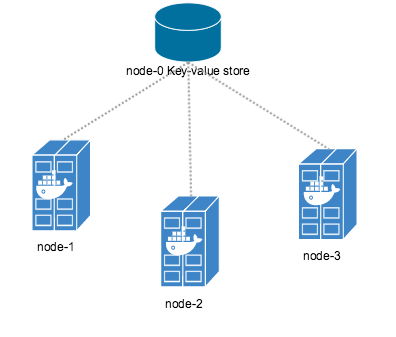
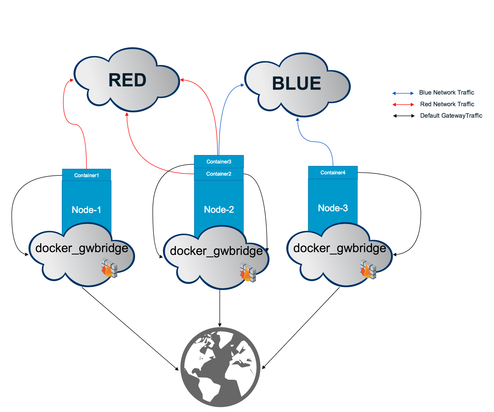
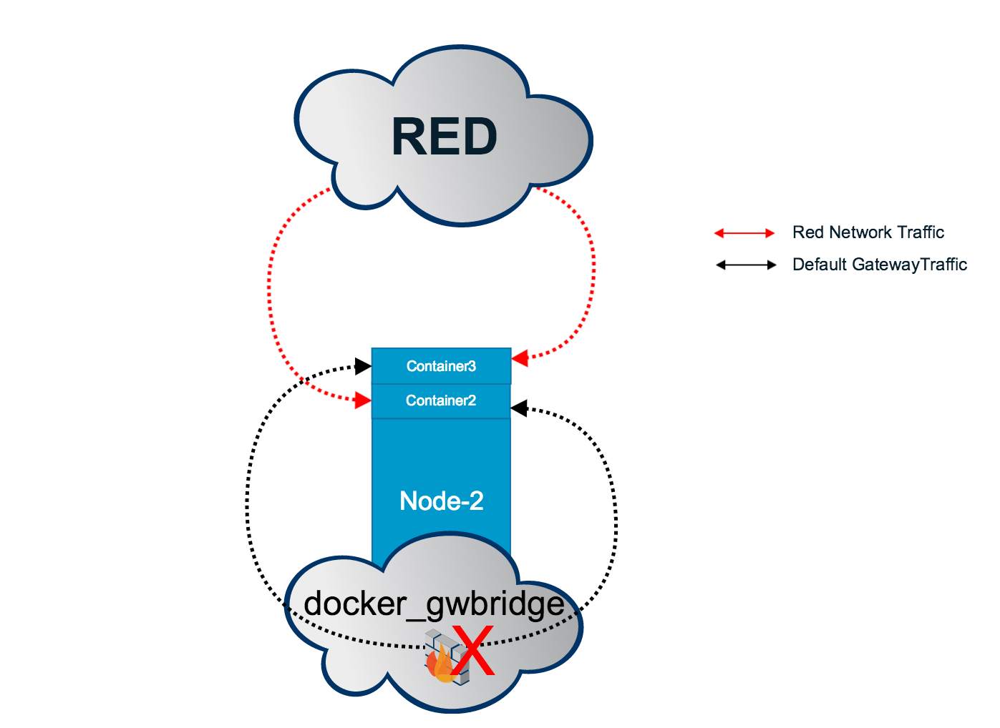
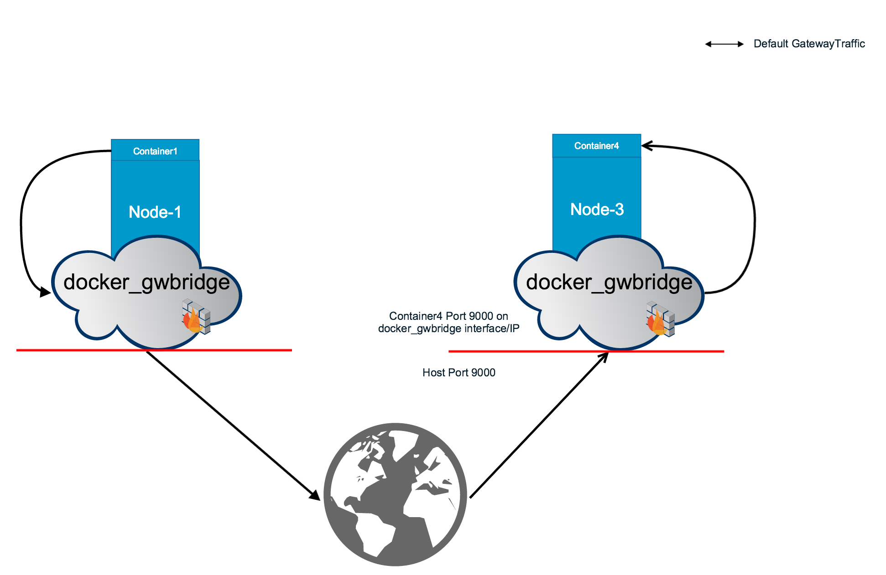

# Lab 6: Docker Networking

> **Difficulty**: Advanced

> **Time**: 30-40 mins

> **Tasks**:
- [Prerequisites](#prerequisites)
- [Task 1: Set up a key-value store](#task-1-set-up-a-key-value-store)
- [Task 2: Configure the engines to use key-value store](#task-2-configure-the-engines-to-use-key-value-store)
- [Task 3: Create the "RED" overlay Network](#task-3-create-the-red-overlay-network)
- [Task 4: Run Containers on the RED network](#task-4-run-containers-on-the-red-network)
- [Task 5: Create the "BLUE" Overlay Network](#task-5-create-the-blue-overlay-network)
- [Task 6: Cross-Network Communication](#task-6-cross-network-communication)
- [Task 7: Reconnecting Containers](#task-7-reconnecting-containers)

# Get started with multi-host networking

**Background**:

Before Docker 1.9, containers running on different hosts had to use the underlying host's TCP/IP stack to communicate between themsleves by mapping a host TCP/UDP port to a container TCP/UDP port. This architecture was limiting and unscalable. In version 1.9, Docker networking was revamped and a new native networking driver was introduced to enable multi-host networking. Multi-host networking enables containers residing on distinct hosts to communicate without relying on the host's TCP/IP stack.

This lab uses an example to explain the basics of creating a mult-host
network. Docker Engine supports this out-of-the-box through the `overlay`
network.  Unlike `bridge` networks overlay networks require some pre-existing
conditions before you can create one. These conditions are:

* Access to a key-value store. Engine supports Consul, Etcd, Zookeeper (Distributed store), and BoltDB (Local store) key-value stores.
* A cluster of hosts with connectivity to the key-value store.
* A properly configured Engine `daemon` on each host in the cluster.
* Underlying host network needs to allow the following TCP/UDP Ports:

	```
Docker Engine port (e.g TCP 2375)
VXLAN: UDP 4789
Serf: TCP + UDP 7946
Key-value store ( e.g for Consul TCP 8500)
	```


## Prerequisites

* You will use all four nodes : node-0 ,node-1 ,node-2 ,and node-3
* Ensure that no containers are running on these containers.
* Ensure that Docker engine uses default daemon options( `DOCKER_OPTS` should be commented out in `/etc/default/docker` file)
* Ensure that DOCKER_HOST is unset ( `$unset DOCKER_HOST` )
* Certain TCP ports are only allowed on the private AWS network. Therefore, you would need to use the private network (10.X.X.X) when you subsitute the IP of the instance in certain commands/configuration files throughout this lab.


## Task 1: Set up a key-value store

An overlay network requires a key-value store. The key-value stores information about the network state which includes discovery, networks, endpoints, ip-addresses, and more. Engine supports Consul, Etcd, and Zookeeper (Distributed store) key-value stores. This example uses Consul.


**Step 1:** Log into **node-0** and run the Consul container as follows:

`docker run -d -p 8500:8500 -h consul --name consul progrium/consul -server -bootstrap`

**Step 2:**  Ensure that the container is Up and listening to port 8500

```
# docker ps
CONTAINER ID        IMAGE               COMMAND                  CREATED             STATUS              PORTS                                                                            NAMES
3092b9afa96c        progrium/consul     "/bin/start -server -"   35 seconds ago      Up 34 seconds       53/tcp, 53/udp, 8300-8302/tcp, 8301-8302/udp, 8400/tcp, 0.0.0.0:8500->8500/tcp   consul
```


## Task 2: Configure the engines to use key-value store

On **node-1,node-2,and node-3**, reconfigure the Docker daemon options listen on TCP port 2375 and to use the Consul k/v store created in Task 1.

**Step 1:**  edit `/etc/default/docker` file and ensure to add the following:

`DOCKER_OPTS="-H tcp://0.0.0.0:2375 -H unix:///var/run/docker.sock --cluster-store=consul://<NODE-0-PRIVATE-IP>:8500/network --cluster-advertise=eth0:2375"`

**Step 2:**  Restart the engine for these settings to take effect:

`sudo service docker restart`

**Step 3:**  Ensure that the engine restarts successfully:

```
# docker ps
CONTAINER ID        IMAGE               COMMAND             CREATED             STATUS              PORTS               NAMES
```

## Task 3: Create the "RED" overlay Network

Now that the three nodes are configured to use the k/v store, you can create an overlay network on any node and it will be distributed to all the nodes.

Before we create an overlay network, let's look at the default networks created by Docker:

```
node-1#docker network ls
NETWORK ID          NAME                DRIVER
38ffb13fa56d        none                null
34c7921e8cb7        host                host
25b439c6c8ca        bridge              bridge   
```

Historically, these three networks are part of Docker's implementation. When you run a container you can use the `--net` flag to specify which network you want to run a container on. These three networks are still available to you.

* The `bridge` network represents the docker0 network present in all Docker installations. Unless you specify otherwise with the docker run --net=<NETWORK> option, the Docker daemon connects containers to this network by default.

* The `none` network adds a container to a container-specific network stack. That container lacks a network interface.

* The `host` network adds a container on the hosts network stack. You'll find the network configuration inside the container is identical to the host.

The new native `overlay` network driver supports multi-host networking natively out-of-the-box. This support is accomplished with the help of `libnetwork`, a built-in VXLAN-based overlay network driver, and Docker's `libkv` library.

**Step 1:** Create your `overlay` network called "RED" with the 10.10.10.0/24 subnet.

```
$ docker network create -d overlay --subnet=10.10.10.0/24 RED
```

**Step 2:** Check that the network is running:

```bash
node-1#docker network ls
NETWORK ID          NAME                DRIVER
7b1cda01f47f        RED                 overlay
38ffb13fa56d        none                null
34c7921e8cb7        host                host
25b439c6c8ca        bridge              bridge   
```
**Step 3:** You can also check that the network was distributed to the other nodes:

```
node-3:~# docker network ls
NETWORK ID          NAME                DRIVER
7b1cda01f47f        RED                 overlay
1ae83a006465        host                host
501f891883cf        bridge              bridge
a141cc346b6c        none                null
```


## Task 4: Run Containers on the RED network

Once your network is created, you can start a container on any of the hosts and it automatically is part of the network.

**Step 1:** Start two containers:

On **node-1**, run a simple **busybox** container named `container1`:

`node-1# docker run -itd --name container1 --net RED busybox`

On **node-2**, run a simple **busybox** container named `container2`:

`node-2# docker run -itd --name container2 --net RED busybox`


**Step 2:** Let's take a look at the network config of container1:

```
node1#docker exec container1 ifconfig
eth0      Link encap:Ethernet  HWaddr 02:42:0A:0A:0A:02
          inet addr:10.10.10.2  Bcast:0.0.0.0  Mask:255.255.255.0
          inet6 addr: fe80::42:aff:fe0a:a02/64 Scope:Link
          UP BROADCAST RUNNING MULTICAST  MTU:1450  Metric:1
          RX packets:13 errors:0 dropped:0 overruns:0 frame:0
          TX packets:8 errors:0 dropped:0 overruns:0 carrier:0
          collisions:0 txqueuelen:0
          RX bytes:1038 (1.0 KiB)  TX bytes:648 (648.0 B)

eth1      Link encap:Ethernet  HWaddr 02:42:AC:12:00:02
          inet addr:172.18.0.2  Bcast:0.0.0.0  Mask:255.255.0.0
          inet6 addr: fe80::42:acff:fe12:2/64 Scope:Link
          UP BROADCAST RUNNING MULTICAST  MTU:1500  Metric:1
          RX packets:14 errors:0 dropped:0 overruns:0 frame:0
          TX packets:8 errors:0 dropped:0 overruns:0 carrier:0
          collisions:0 txqueuelen:0
          RX bytes:1128 (1.1 KiB)  TX bytes:648 (648.0 B)

lo        Link encap:Local Loopback
          inet addr:127.0.0.1  Mask:255.0.0.0
          inet6 addr: ::1/128 Scope:Host
          UP LOOPBACK RUNNING  MTU:65536  Metric:1
          RX packets:0 errors:0 dropped:0 overruns:0 frame:0
          TX packets:0 errors:0 dropped:0 overruns:0 carrier:0
          collisions:0 txqueuelen:0
          RX bytes:0 (0.0 B)  TX bytes:0 (0.0 B)
```

You can see that `eth0` was assigned an IP from RED's `10.10.10.0/24` subnet. You will also notice `eth1` with a `172.18.0.0/16` address. When you create your first overlay network on any host, Docker also creates another network on each host called `docker_gwbridge`. This network is used to provide external access for containers. Every container that is part of an overlay network also gets an `eth` interface in the `docker_gwbridge` to allow it to access the external world. The `docker_gwbridge` is similar to the default `bridge` network, but unlike the `bridge` it restricts Inter-Container Communciation(ICC). Docker will create only one
`docker_gwbridge` bridge network per host regardless of the number of overlay networks present.

**Step 3:** Let's take a look at another cool feature of the overlay networks, which is container discovery.

```
node-1:~# docker exec container1 cat /etc/hosts
10.10.10.2	42b58f7ea6dd
127.0.0.1	localhost
::1	localhost ip6-localhost ip6-loopback
fe00::0	ip6-localnet
ff00::0	ip6-mcastprefix
ff02::1	ip6-allnodes
ff02::2	ip6-allrouters
10.10.10.3	container2
10.10.10.3	container2.RED
```

You can see that Docker took care of adding an entry for each container that is part of the same overlay network. Therefore, to reach container2 from container1, you can simply use its name. Docker automatically updates `/etc/hosts` when containers connect and disconnet from an overlay network.

```
node-1:~# docker exec container1 ping container2
PING container2 (10.10.10.3): 56 data bytes
64 bytes from 10.10.10.3: seq=0 ttl=64 time=1.221 ms
64 bytes from 10.10.10.3: seq=1 ttl=64 time=1.106 ms
64 bytes from 10.10.10.3: seq=2 ttl=64 time=1.042 ms
```
**Step 4 :** All TCP/UDP ports are open on an overlay network. There is no need to do any host-port mapping to expose these ports to the other containers on the same network.

Let's test a TCP connection between container1 and container2.

On **node-2**, grab the `10.10.10.X` IP addresss:

```
node-2:~# docker exec container2 ifconfig | grep '10.10.10'
inet addr:10.10.10.3  Bcast:0.0.0.0  Mask:255.255.255.0

```

Then have container2 listen on port **9000** on that interface:

```
node-2:~# docker exec container2 nc -l 10.10.10.3:9000
```

On **node-1**:

```
node-1:~# docker exec -it container1 nc container2 9000 &> /dev/null; echo $?
0
```

If the output is `0`, then you have successfully established a TCP connection on port 9000.


## Task 5: Create the "BLUE" Overlay Network



**Step 1:** let's create another `overlay` network called "BLUE" with the 10.10.20.0/24 subnet instead.

```
node1$ docker network create -d overlay --subnet=10.10.20.0/24 BLUE
```

**Step 2:** Let's also create two other containers: **container3** and **container4**.  Container3 will be on **node-2** but will connect to both networks ( `RED` and `BLUE`). **container4** will be on **node-3:** and will connect to the `BLUE` network. This way, container3 is able to communicate to container4 over the `BLUE` network, and  to **container1** and **container2** over the `RED` network.


On **node-2**, run a simple **busybox** container named `container3`.

```
node-2:~# docker run -itd --name container3 --net RED busybox
81f1d923a406471f2a3abdd2c56e942079c27cf092d45d241291156bd033f15d
node-2:~# docker network connect BLUE container3
```

On **node-3**, run a simple **busybox** container named `container4`.

`docker run -itd --name container4 --net BLUE busybox`

Observe that container3 now has interfaces in both networks.

```
node-2:~# docker exec container3 ifconfig
```

## Task 6: Cross-Network Communication

Container2 and container3 can communicate over the `RED` overlay network. Although they are both on the same `docker_gwbridge` , they cannot communicate using that bridge network without host-port mapping. The `docker_gwbridge` is used for all other traffic.




Container1 and container4 are on separate overlay networks and by default can not communicate. If we need them to communciate, we can either put them on the same overlay network or map them to a host port. If we map a host-port to the container port, the container's `docker_gwbridge` interface/IP address will be mapped to the host's IP/Port. Let's connect container1 and container4 using host-port mapping.



On **node-3**:

```
node-3:~# docker rm -f container4
node-3:~# docker run -it --name container4 --net BLUE -p 9000:9000 busybox nc -l 0.0.0.0:9000
```

On **node-1**:

```
node-1:~# docker exec -it container1 nc <NODE_3_PRIVATE_IP> 9000 &> /dev/null; echo $?
0
```

If the output is `0`, then you have successfully established a TCP connection on port 9000 using host-port mapping.


## Task 7: Reconnecting Containers

Containers can easily be disconnected from any network and reconnected to another.
Let's disconnect container2 from `RED` network and attach it to `BLUE` network:

```
node-2:~# docker network disconnect RED container2
node-2:~# docker network connect BLUE container2
```
Observe that container2 has an interface in `BLUE` network.

```
node-2:~# docker exec container2 ifconfig
```

## Conclusion

Congrats! You have completed the tutorial!

In this tutorial we went over the new Docker Networking features introduced in 1.9. We created a two multi-host overlay network that spanned multiple Docker hosts. We also observed how inter-container networking works in different scenarios.

### Share on Twitter!

<p>
<a href="http://ctt.ec/44gMe" target=“_blank”>

</p>


## Cleanup

If you plan to do another lab, you need to cleanup your EC2 instances. Cleanup removes any environment variables, configuration changes, Docker images, and running containers. To do a clean up,

1. Log into each EC2 instance you used and run the following:

      $ source /home/ubuntu/cleanup.sh


## Related information

* [Docker Multi-Host Networking overview](http://blog.docker.com/2015/11/docker-multi-host-networking-ga/)
