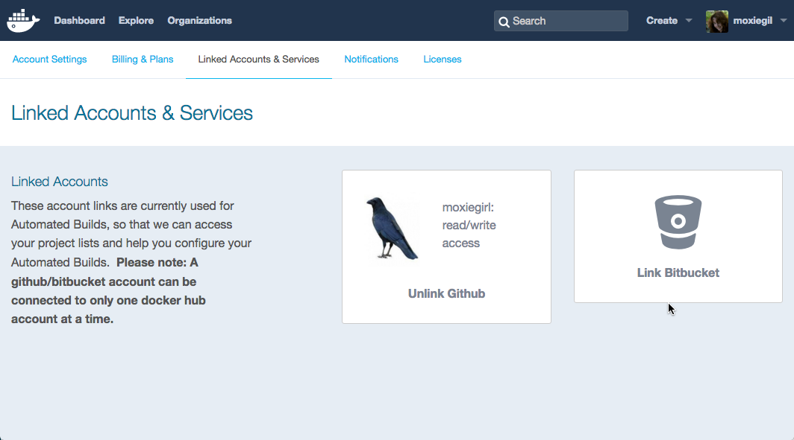
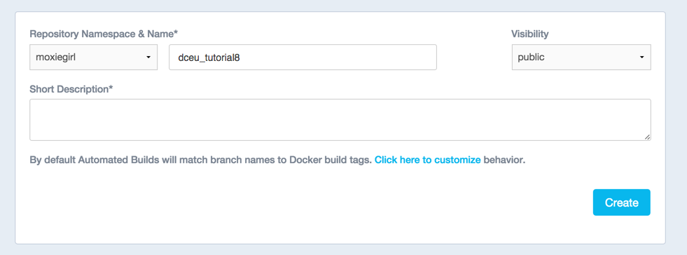
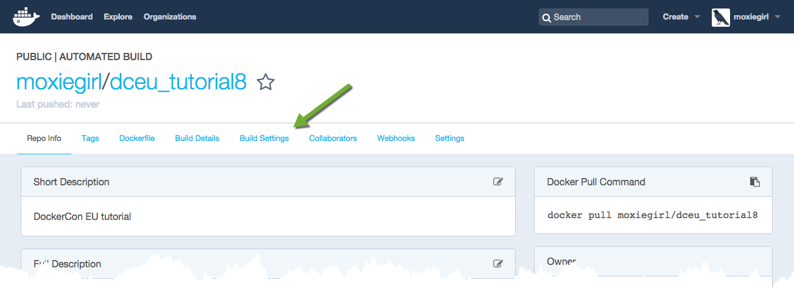
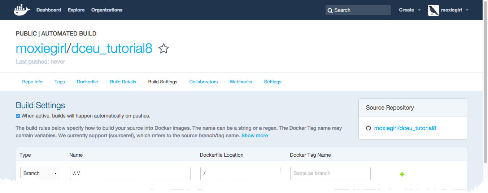
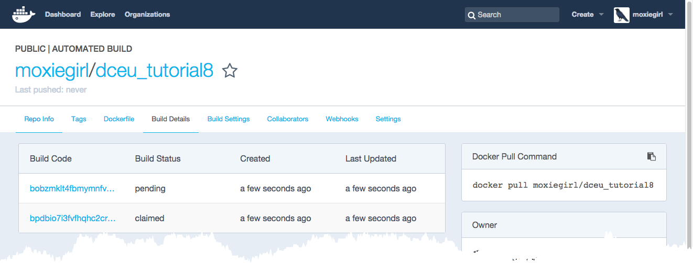

# Lab 8: Automated Image Builds with Docker Hub

> **Difficulty**: Easy
>
> **Time**: 30 minutes
>
> **Tasks**:
>
>* [Prerequisites](#prerequisites)
>* [Task 1: Link your Docker Hub account to GitHub](#task-1-link-your-docker-hub-account-to-github)
* [Task 2: Fork and clone the tutorial repo](#task-2-fork-and-clone-the-tutorial-repo)
* [Task 3: Create a new automated build](#task-3-create-a-new-automated-build)
* [Task 4: Manually Trigger a Build](#task-4-manually-trigger-a-build)
* [Task 5: Review the build results](#task-5-review-the-build-results)
* [Task 6: Trigger an Automated build](#task-6-trigger-an-automated-build)

## What is an Automated Build?
An automated build is a Docker image build that is triggered by a code change in a GitHub or Bitbucket repository. By linking a remote code repository to a Docker Hub automated build repository, you can build a new Docker image every time a code change is pushed to your code repository.

## Prerequisites

While Docker Hub supports linking both GitHub and Bitbucket repositories, this lab uses a GitHub repository. If you don't already have one, make <a href="https://github.com/join" target="_blank">sure you have a GitHub account</a>. A basic account is free.

This lab clones and later pushes a GitHub repository using the HTTPS protocol.
The `git` commands you use in the lab require that you set your config. Finally,
if you do have a GitHub account and that account is using two-factor
authentication, you need to <a
href="https://github.com/blog/1614-two-factor-authentication#how-does-it-work-for-command-line-git"
target="_blank">create a token</a> before attempting the `docker push`. Without
the token you cannot authenticate over HTTPS.

## Task 1: Link your Docker Hub account to GitHub

1. Log into Docker Hub.

2. Navigate to <a href="https://hub.docker.com/account/authorized-services/" target=_blank>Profile &gt; Settings  &gt; Linked Accounts & Services</a>.

3. Click the GitHub service.

    The system prompts you to choose between Public and Private and Limited Access. The Public and Private connection type is required if you want to use the Automated Builds.

4. Press Select under Public and Private connection type.

    If you are not logged into GitHub, the system prompts you to enter GitHub credentials before prompting you to grant access. After you grant access to your code repository, the system returns you to Docker Hub and the link is complete.

    

## Task 2: Fork and clone the tutorial repo

Automated builds rely on you having a code repository that contains a Dockerfile and build context. In this step, you fork a copy of a demo repo into your GitHub account. A fork allows you to make changes to the repo without affecting other users.  

After forking the demo repo, you'll clone the code to one of your nodes. The demo repository defines a container for an Nginx web server with a very simple `index.html` file

1. In a browser window navigate to http://www.github.com/mikegcoleman/dceu_tutorial8

2. Click the Fork button in the upper right hand corner of the page.

  GitHub redirects you into your own version of the tutorial repository. When it
  is done, your browser URL should be `https://github.com/<your githhub user
  name>/dceu_tutorial8`.

3. Open a terminal window and SSH into your `node-3` host.

  		ssh -i <identity file> <user>@<Node-3 IP Addresst>

	For example:

  		$ ssh -i user23.pem ubuntu@10.0.0.100

4. Change to your ubuntu home directory.

        $ cd

5. Inside the terminal window, clone your GitHub repo.

  

  If you want to copy and paste the URL, click the clipboard under “HTTPS clone	url” on your GitHub repo web page.

  	 git clone https://github.com/<github username>/dceu_tutorial8.git

  For example:

        $ git clone http://www.github.com/moxiegirl/dceu_tutorial8.git
    		Cloning into 'dceu_tutorial8'...
    		remote: Counting objects: 7, done.
    		remote: Compressing objects: 100% (5/5), done.
    		remote: Total 7 (delta 0), reused 7 (delta 0), pack-reused 0
    		Unpacking objects: 100% (7/7), done.
    		Checking connectivity... done.

6. Take a moment to investigate your new repository.

        $ cd dceu_tutorial8/
        $ ls
        Dockerfile  index.html  README.md

  You'll find a `Dockerfile` and the `index.html` at the root.

# Task 3: Create a new automated build

Now that you have a repository , let's create an automated build that fires off any time a change is pushed to our GitHub repository.

1. In your web browser, navigate back to http://hub.docker.com and log in if you aren't already.

2. Select Create > Create Automated Build from Docker Hub.

  The system prompts you with a list of User/Organizations and code repositories.

2. Select your GitHub account from the User/Organizations list on the left.

  The list of repositories change.

4. Pick the `dceu_tutorial8` project to build.

  If you have a long list of repos, use the filter box above the list to restrict the list. After you select the project, the system displays the Create Automated Build dialog.

  

5. Type in `DockerCon EU tutorial` for the Short Description.

7. Click Create.

	It can take a few minutes for your automated build job to be created. When the system is finished, it places you in the detail page for your image repository.

## Task 4: Manually Trigger a Build

Before you trigger an automated build by pushing to your GitHub `dceu_tutorial8` fork, you'll trigger a manual build. Triggering a manual build ensures everything is working correctly.

1. Navigate to your automated build page.

  

2. Choose Build Settings.

  At the top of the Build Settings dialog is a list of configured builds. You can build from a code branch or by build tag.

  

  Docker builds everything listed whenever a push is made to the code
  repository. If you specify a particular branch or tag, you can manually build
  that image by pressing the Trigger. If you use a regular expression syntax
  (regex) to define your build branch or tag, Docker does not give you the
  option to manually build.

3. Press the + (plus sign).

4. Choose Type > Branch.

    You can build by a code branch or by an image tag.     You can enter a
    specific value or use a regex to select multiple values.  To see examples of
    regex, press the Show More link on the right of the page.

    

5. Enter the `master` for the name of the branch.

6. Leave the Dockerfile location as is.

    Recall the file is in the root of your code repository.

7. Specify `latest` for the Tag Name.

8. Press Save Changes.

  A Trigger button appears by your new build configuration.

9. Press Trigger.

  You can only trigger one build at a time and no more than one every five
  minutes. If you already have a build pending, or if you recently submitted a
  build request, Docker ignores new requests.

## Task 5: Review the build results
The Build Details page shows a log of your build systems:

1. Navigate to the Build Details page.

2. Wait until your image build is done.

3. Copy the Docker Pull Command from the right  side of the page.

4. Switch back to your terminal window and pull down your newly built image

		  docker pull <docker hub username>/dceu_tutorial8

    For example:

        $ docker pull moxiegirl/dceu_tutorial8
    		Using default tag: latest
    		latest: Pulling from moxiegilr/dceu_tutorial8
    		90d7a4de1ef5: Pull complete
    		60b05e04b5b6: Pull complete
    		95d79d93cde4: Pull complete
    		Digest: sha256:eab8584e5b08227637ff7ff77b933e062f3abb031b6e423bbf465d408632eae9
    		Status: Downloaded newer image for moxiegirl/dceu_tutorial8:latest

5. Run the image to make sure it's executing correctly

		docker run -d -p 80:80 --name mywebserver <docker hub username>/dceu_tutorial8

6. In your web browser, navigate to your `node-3` IP address.

    You should see aweb page with the text `"Hola, Barcelona"`.

7. Switch back to your terminal window, stop and remove your running container

		$ docker stop mywebserver
		mywebserver

		$ docker rm mywebserver
		mywebserver

8. Remove the web server image

        docker rmi <docker hub username>/dceu_tutorial8

  For example:

    		$ docker rmi moxiegirl/dceu_tutorial8
        Untagged: moxiegirl/dceu_tutorial8:latest
        Deleted: b10dfa917433ffa9d607e455f8ff6fb1eef3e05e8155114133a469bc286acf4f
        Deleted: 30ed62e32a0400ca3eaf690994084145f5ddee6a43907330ba3a56f7f6e8026c
        Deleted: c1c8f9501c437973ed0aa768a937e4e64143af6c02efb0b0793fa9e4d3005e33
        Deleted: 914c82c5a678cf9fa73c25d91d30f5e174ac69f6b494890d262cc58f43b304ef
        Deleted: a96311efcda8ee1e48c0f499d54ad1c2a5387376d43c379837f38562e85a03f2
        Deleted: edeba58b4ca77142435dfa2b190c0b3922e7bb4bcfb55c786d091baec7a5dbcd

## Task 6: Trigger an Automated build

Now that you've confirmed your image builds manually, you'll push a change to
the GitHub repo. This change will trigger an automated build of your
`dceu_tutorial8` Docker image.

1. In your terminal window, change to the `dceu_tutorial8` directory.

		$ cd ~/dceu_tutorial8

2. Change the `index.html` file for the webserver.

		$ echo 'Docker es el mejor' > index.html

	Make sure to use single quotes (').

3. List the `index.html` file's contents to make sure they were updated.

    		$ cat index.html
        Docker es el mejor

4. Set your Git config if you haven't already.

      git config --gobal user.email "you@youremail.com"
      git config --gobal user.name "Firstname Lastname"

5. Add the updated file to your GitHub repo

		$ git add .

6. Commit the change

		$ git commit -m "updated index.html"
		[master 72e748d] updated index.html
	 	1 file changed, 1 insertion(+), 1 deletion(-)

7. Push you changes to the GitHub repo.

		$ git push origin master

  The system prompts you for your GitHub username and password.

		Counting objects: 3, done.
		Delta compression using up to 8 threads.
		Compressing objects: 100% (2/2), done.
		Writing objects: 100% (3/3), 277 bytes | 0 bytes/s, done.
		Total 3 (delta 1), reused 0 (delta 0)
		To https://github.com/<github username>/dceu_tutorial8.git

8. In your web browser, navigate back to Docker Hub.

9. Go to your `dceu_tutorial8` Build Details page and confirm that there is a new build.

  Do not move to the next step until your build completes.

10. Copy the "Docker Pull Command" from the page's right hand side.

11. Switch back to your terminal window and pull down your newly built image.

		$ docker pull <docker hub username>/dceu_tutorial8

		Using default tag: latest
		latest: Pulling from <docker hub username>/dceu_tutorial8
		90d7a4de1ef5: Pull complete
		60b05e04b5b6: Pull complete
		95d79d93cde4: Pull complete
		Digest: sha256:eab8584e5b08227637ff7ff77b933e062f3abb031b6e423bbf465d408632eae9
		Status: Downloaded newer image for <docker hub username>/dceu_tutorial8:latest

12. Run the `webserver` to make sure it's executing correctly

		$ docker run -d -p 80:80 --name mywebserver <docker hub username>/dceu_tutorial8
		b9d2496ba15ebd61d288028ae45f2479267ed4c183920b3080ebe2735eca133e

13. Now, in your web browser navigate to your `node-3` IP address.

    You should see a  web page with the text `"Docker es el mejor"`.

## Conclusion

Congrats !! you have completed this lab and learned how to integrate Github and DockerHub to automate your image builds!

### Share on Twitter!

<a href="http://ctt.ec/r5iVP" target=“_blank”>

## Clean up

If you plan to do another lab, you need to cleanup your EC2 instances. Cleanup removes any environment variables, configuration changes, Docker images, and running containers. To do a clean up,

1. Log into each EC2 instance you used and run the following:

        $ source /home/ubuntu/cleanup.sh

3. In your web browser, navigate to your `dceu_tutorial8` repository on Docker Hub

4. Click Settings (**not** Build Settings).

5. Press Delete.

4. Enter the repository name `dceu_tutorial8` when prompted.

6. Press Delete.

7. In your browser, navigate \GitHub `dceu_tutorial8` repo.

		https://github.com/<github username>/dceu_tutorial8

8. On the right hand side of the web page click Settings.

9. Scroll down to the Danger Zone and click Delete this Repository.

10. Enter the repository name.

		<githug username>/dceu_tutorial8

11. Press I understand the consequences, to delete this repository.

## Related information

[Docker Hub](http://docs.docker.com/docker-hub/) documentation.
