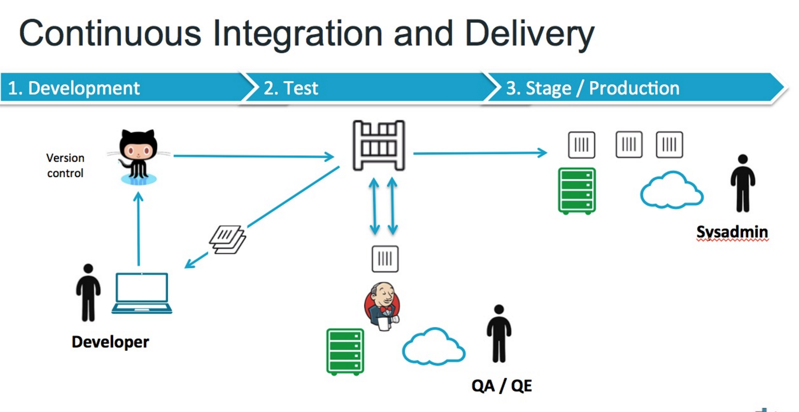
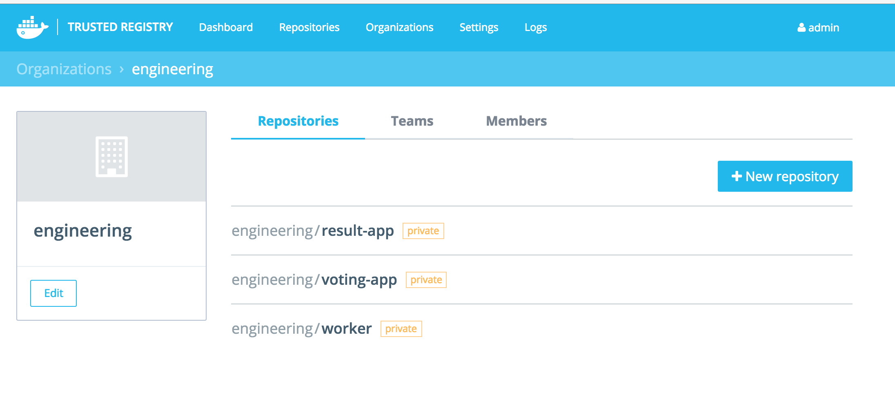
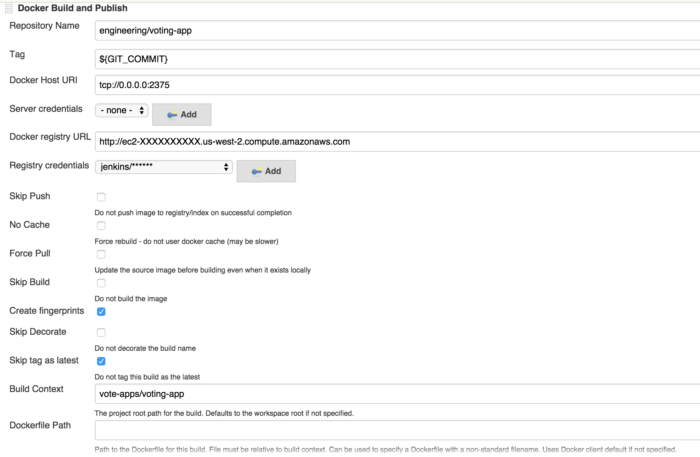
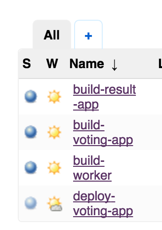

# Lab 9: Continuous Integrationn and Continious Delivery(CICD) with Docker, GitHub, and Jenkins

> **Difficulty**: Advanced

> **Time**: 75-90 minutes

> **Tasks**:
> 
> 
- [Overview](#overview)
- [Prerequisites](#prerequisites)
- [Task 1: Jenkins Setup](#jenkins-setup)
- [Task 2: Github Repo and Webhooks](#github-repo-and-webhooks)
- [Task 3: DTR Setup](#dtr-setup)
- [Task 4. The Build Jobs](#the-build-jobs)
- [Task 5: The Deploy Job](#the-deploy-job)
- [Task 6: Deploying the App](#depliying-the-app)

# Overview



Docker is the open platform to build, ship and run distributed applications, anywhere. At the core of the Docker solution is a registry service to manage images and the Docker Engine to build, ship and and run application containers.  Continuous Integration (CI) and Continuous Delivery (CD) practices have emerged as the standard for modern software testing and delivery.  The Docker solution accelerates and optimizes CI/CD pipelines, while maintaining a clear separation of concerns between the development and operations teams.

In this lab, you will build and deploy [The Awesome Voting App](https://github.com/nicolaka/example-voting-app) using a CI pipeline consisting of Docker, GitHub, Jenkins, and Docker Trusted Registry (DTR). The pipeline will be kicked off by a commit to a GitHub repository. The commit will cause Jenkins to run (3) build+push to DTR jobs on a Jenkins slave, and upon successful completion of these jobs, pull new images from DTR and deploy the app on Swarm using `docker-compose`. The following diagram illustrates the CI pipeline. 


The app is deployed using Docker Compose and consists of 5 different containers as follows. Since we will be using Docker multihost networking, all containers will be part of the same overlay network and do not require any linking.

```
voting-app:
  image: $DTR/engineering/voting-app:$GIT_COMMIT
  ports:
    - "5000:80"
redis:
  image: redis
  ports: ["6379"]

worker:
  image: $DTR/engineering/worker:$GIT_COMMIT

db:
  image: postgres:9.4

result-app:
  image: $DTR/engineering/result-app:$GIT_COMMIT
  ports:
    - "5001:80"
```

**Setup Reference:**

* `node-0` will host DTR, Swarm Manager, Jenkins Master.
* `node-1` will be a Jenkins Slave and a Swarm Node.
* `node-2` will be a Swarm Node.
* `node-3` will be a Swarm Node.

## Prerequisites

* This lab only works with a cloud-based setup ( local Docker Machine setup will not work).
* You will use all four nodes : `node-0`,`node-1`,`node-2`, and `node-3`. 
* This lab requires a Swarm cluster. Please follow Lab #2 Task #2 to create a Swarm cluster. Ensure that the Swarm cluster is functional and does NOT run any containers.
* This lab requires a Docker Trusted Registry (DTR). Please go through Lab #3 to set up and configure DTR on `node-0`.
* This lab requires a Github account.
* This lab requires multi-host networking. Please follow Lab #6 Task 1 and 2 to set up multi-host networking for the Swarm cluster.
* docker-compose version 1.5.0 + must be installed on all Swarm nodes. Check using `docker-compose version` on `node-1`,`node-2`, and `node-3`.

**Note :** Throughout this lab, you may be required to substitute the IP of an instance. AWS only allows certain TCP ports on the private AWS network. Therefore, make sure you use the private network (10.X.X.X) when you substitute the IP of the instance.

**Note :** Finally, some of the actions in this lab require `sudo`. Where `sudo` is required, the lab so indicates.

## Task 1: Jenkins Setup

**Step 1:** Log in to  `node-0` :

`ssh -i <username>.key ubuntu@<username-node-0 IP Address>`

**Step 2:** Install a Jenkins Master container locally (not on the Swarm cluster).

`$ docker run -d -p 8080:8080 jenkins`

**Step 3:** Using your web browser, go to `node-0`'s domain name/IP using port 8080.

**Step 4:** Go to **Manage Jenkins** > **Configure Global Security**. Click on **"Enable Security"** then select **"Jenkin's own data base"**. For Authorization, select **"Logged-in users can do anything"**. Click on **Apply**  and **Save**. 


**Step 5:** Create a Jenkins user by clicking on **Create a new user** and complete the form. You should be signed in after completing the form. 

**Step 6:** Making `node-1` a Jenkins Slave node:

For this step please make sure that Java is installed on that node. You can do so by performing the following:

`sudo apt-get install -y default-jre`

Then go to **Manage Jenkins > Manage Nodes > New Node(Dumb Node)** and fill in `node-1`'s details.  Make sure you have `/home/ubuntu` as the slave’s home directory. 
 
You will be using SSH to connect and manage this node (default launch method). Copy/paste `node-1`'s DNS name and SSH keys ( the AWS key that was provided to you) to install JPLN on node. What this does is that it configures the Jenkins Master server to connect via ssh to the Jenkins slaves and then run the jobs on these slave nodes. Increase the number of executors to 4+.

**Step 7:**  In this exercise, no jobs should run on Master node, go to to **Jenkins Dashboard> Nodes > Master > Configure** and ensure that # of executors is 0.

You should see that the new slave ( in this case called `slave1`) is added to your Jenkins node:


**Step 8:** Install Required Jenkins Plugins

We will need the following plugins installed : **Github Plugin** and **CloudBees Docker Build and Publish** plugin. Go to **Manage Jenkins > Manage Plugins** , search for these plugins and install them. **Note:** make sure  to select **“Restart after Installation”** when installing these plugins.

## Task 2: Github Repo and Webhooks

**Step 1:** Log into your Github account and fork the following repo:

	https://github.com/nicolaka/example-voting-app
	
**Step 2:**  Configure Github to trigger Jenkins jobs. To be able to trigger Jenkins jobs when a new commit is made to your Github repo, we would need two things. 

* Github needs to trigger a webhook to the Jenkins master. Therefore, we would need to configure the Github repo to do that. If you go to your Github repo ( forked from `nicolaka/example-voting-app`) and go to **Settings > Webhooks & Services > Add Service > search for  Jenkins (GitHub plugin)** and then add the following Jenkins url : `http://<node_0_url>:8080/github-webhook/` . This will send an HTTP POST message to the Jenkins Master telling it that the repo had changed.
	
* Jenkins needs to be able to pull your repo. If this is a public repo, then no need to supply any credentials . If it's private, then you would need to provide your Github account credentials to the Github Plugin ( within Jenkins). 

## Task 3: DTR Setup

The voting app has 5 different microservices. **voting-app,worker, and result-app** are built from the repo that you cloned. The other two ( **db and redis**) use standard Docker Hub images. In this task, you will create the appropiate DTR repos from the UI and ensure that each of the nodes in the Swarm cluster can pull from/push to DTR successfully. Please remember that you do need to install DTR as instructed in Lab #3. 

**Step 1:** Creating the `jenkins` DTR user

Go to your **DTR UI >> Settings >> Auth**, and add a new user `jenkins`, set its password, and give it **Admin Global Role**. Click **Save**.

**Step 2:** Creating the Repos.

If you completed the DTR Lab #3, you have already created the `engineering` organization, if not just create it. 

**Note:** You Need to ensure that you create your repos under this organization. The Docker Compose file points to this organization.

Click on **Ogranizations** > **engineering**, and click on **New Repository**. You need to create three repositories **voting-app,worker, and result-app** , set them as **Private** repostitories and **Save** as follows:



**Step 3:** Trusting DTR Certificates on Docker Engines

In order to login successfully into DTR, you need to trust DTR's certificates on each of the Swarm nodes(node-1,node-2,node-3). You can do so by doing the following ON EACH NODE OF THE CLUSTER.

```
$ export DTR_DOMAIN_NAME=<DOMAIN NAME OF node-0>
$ docker run --rm -v /etc/docker/certs.d/:/etc/docker/certs.d/ -e DTR_DOMAIN_NAME=$DTR_DOMAIN_NAME nicolaka/dtr-trust:v1
```

This will run a container that will trust DTR's certificate automatically.


## Task 4: The Build Jobs

The Voting app has 5 different microservices : `voting-app , redis, worker, db, result-app`.  
**voting-app,worker, and result-app** are built from the repo that you cloned. The other two ( **db and redis**) use standard Docker Hub images. You will create three build jobs for building the images required to deploy the app. These build jobs will be triggered independentaly whenever changes are made to the Github repo. It's really important to be careful with the info you provide when creating a new job. You will repeat the following steps for each of the 3 build jobs, changing the name of the 3 microservices : **voting-app, worker, and result-app**. 

**Step 1:**  Go to **Manage Jenkins > New Item** [ Freestyle ]. Provide a name for your item. 

Suggestion: Use a name that would indicate what this job is all about : `build-voting-app`, `build-voting-app`, or `build-worker`

**Step 2:** Under **Source Code Management** select **Git**. Provide the url to YOUR repo (e.g https://github.com/YOUR_USERNAME/example-voting-app.git). No need for any credentials if the repo is public.

**Step 3:** Under **Build Triggers**, select **Build when a change is pushed to GitHub**.

**Step 4:**  Under **Build** section, select **Docker Build and Publish** option. For each new job created, use one name of the specific image to be built in this job `engineering/voting-app`,  `engineering/worker`, or `engineering/result-app`.

For this example, use `${GIT_COMMIT}` as the tag. This will use Git's sha256 hash as the image tag. 

Docker Host URI is the URI for engine where you'd like to BUILD the image, please use `tcp://0.0.0.0:2375`. This means that as Jenkins runs this script on your `node-1`, it will also build the image locally.

**Step 5:** Provide DTR DNS name under (Docker registry URL). You would need to provide a username/password credentials to be able pull/push to this registry. Please use `jenkins` username and password that you created in Task #3.

**Step 6:** Under **Advanced settings**, Ensure that your **Build Context** path is listed as `vote-apps/voting-app`,`vote-apps/worker`, or `vote-apps/result-app`. This will tell `docker build` to look for a Dockerfile in that directory and NOT in repo's root directory.

Ensure that **Skip tag as latest** is checked.

**Step 7:** Your configs should be as follows. You should then click **Apply** + **Save**.





**Step 8:** Ensure you repeate the above steps for all three build jobs: **build-voting-app,build-worker, and build-result-app**. You can select to create the subsequent jobs as copies from the first one you create by clicking on **New Item** >> **Copy existing Item** and type in the name of the first job you created.

**Step 9:**  Try testing the jobs first( **Build Now**) and ensure that the jobs run successfully and push the new images to DTR.


## Task 5: The Deploy Job

You will create a single deploy job for (re)deploying the voting app. Although there are Jenkins plugins to deploy docker containers, deploying using Docker Compose is not supported with these plugins. We will use a bash script to deploy the app! This job will get triggered after the three uptream build jobs are completed successfully.

**Step 1:** Go to **Manage Jenkins > New Item [ Freestyle ]**. 

**Step 2:** Provide a name for your item (e.g `vote-apps-deploy`)

**Step 3:** Under Source Code Management select Git. Provide the url to your repo (e.g `https://github.com/YOUR_USERNAME/example-voting-app`). No need for any credentials if the repo is public.

**Step 4:** Under Build Triggers, select "Build after other projects are built", and type the names of all three build jobs you created in Task #4 (e.g)

**Step 5:** Under Build section, select **"Execute Shell"**. Please use the following shell:

```
export DOCKER_HOST=$node-0-DOMAIN-NAME:3375
export DTR=$node-0-DOMAIN-NAME
docker-compose --x-networking -f vote-apps/docker-compose.yml stop voting-app result-app worker
docker-compose --x-networking -f vote-apps/docker-compose.yml rm -f 
docker-compose --x-networking -f vote-apps/docker-compose.yml pull voting-app result-app worker
docker-compose --x-networking -f vote-apps/docker-compose.yml up -d 
```

This script will use Docker Compose to stop and recreate any running services with up-dated images from DTR.


**Step 6:** click **Apply** + **Save**.

## Task 6: Deploying the App

Now that you have completed both the build and deploy jobs. You can deploy the app using a single git commit!

**Step 1:** On your preferred dev environment ( local, docker-machine, or any of the AWS instances), clone the repo from Github.

	git clone https://username@github.com/$YOUR_USERNAME/example-voting-app.git

Ensure that you sign in to Github to be able to perform a git push.

**Step 2:** Edit the README.md file of the repo and do a Git commit.

```
$ cd example-voting-app
$ echo "#test" >> README.md
$ git add .
$ git commit -am "edited README.md"
$ git push

```

**Step 3** Check the deployment process.

The git push from Step 2 should have triggered the build jobs. If you navigate to your Jenkins server, you should see the three jobs being run:



You can also check that your Swarm cluster to confirm. Go to `node-0` and you should see something similar to the following:

```
$ export DOCKER_HOST=0.0.0.0:3375
$ docker ps
CONTAINER ID        IMAGE                                                                             COMMAND                  CREATED             STATUS              PORTS                        NAMES
146205a6c39d        <DTR_HOSTNAME>/engineering/result-app:c8653b784d4400bdbc1f748b802bed86ab8d9f0a   "node server.js"         28 seconds ago      Up 28 seconds       10.0.0.165:5001->80/tcp      ip-10-0-0-165/voteapps_result-app_1
f145673fb808        <DTR_HOSTNAME>/engineering/voting-app:c8653b784d4400bdbc1f748b802bed86ab8d9f0a   "python app.py"          40 seconds ago      Up 39 seconds       10.0.0.164:5000->80/tcp      ip-10-0-0-164/voteapps_voting-app_1
62890d2fe373        <DTR_HOSTNAME>/engineering/worker:c8653b784d4400bdbc1f748b802bed86ab8d9f0a       "/usr/lib/jvm/java-7-"   41 seconds ago      Up 40 seconds                                    ip-10-0-0-164/voteapps_worker_1
1c6d0c43cf79        postgres:9.4                                                                      "/docker-entrypoint.s"   57 minutes ago      Up 57 minutes       5432/tcp                     ip-10-0-0-163/voteapps_db_1
ab2bde390e8a        redis                                                                             "/entrypoint.sh redis"   57 minutes ago      Up 57 minutes       10.0.0.165:32775->6379/tcp   ip-10-0-0-165/voteapps_redis_1
```

Now you can check out the app from your browser by going the nodes that are either running the `voting-app` or `result-app` on ports 5000 and 5001 respectively.


You can now edit various components in the repo and with a single commit trigger a full redeployment of the changes. For example, you can change the voting options by editing the `app.py` under `voting-app` module in the repo. 

**Note:** The app containers may be redeployed on different nodes so ensure that you are using the correct DNS name or IP.

## Conclusion

Congrats! You have completed the tutorial!

In this tutorial you learned how to create a full CICD pipeline using Docker, GitHub and Jenkins. You learned how to integrate that workflow with DTR to store the images and Docker Compose to deploy them on a Swarm Cluster.


## Related information

* [Docker and Continious Integration](https://www.docker.com/products/use-cases)
